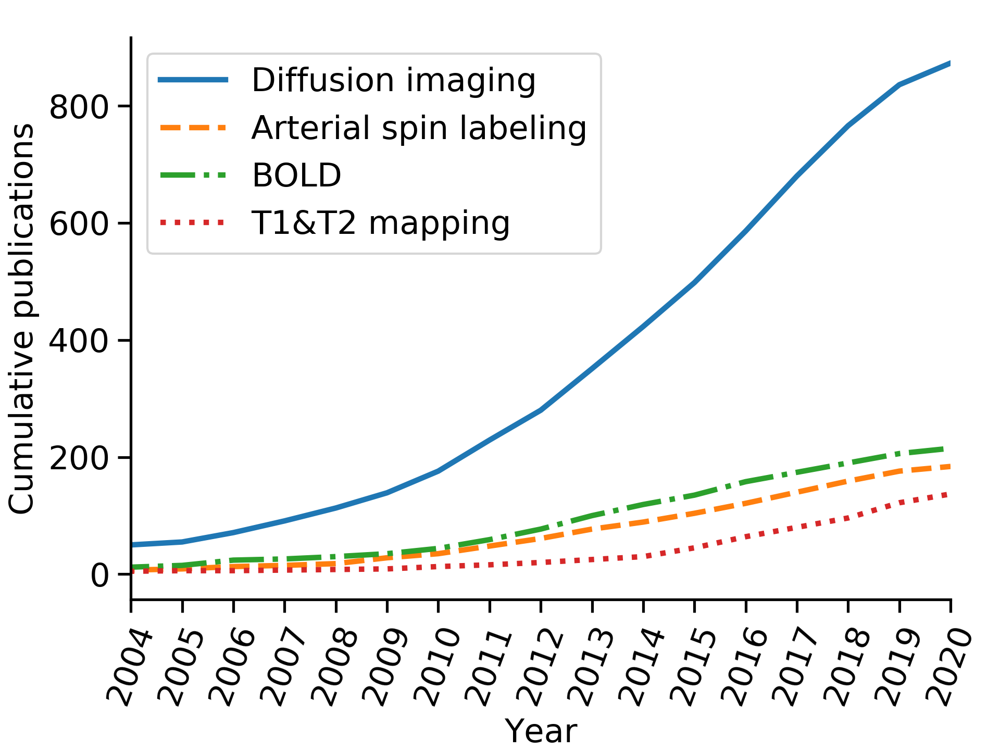

# `cumulative_publications`

Python project containing code which searches PubMed (using the [Bio.Entrez package](https://biopython.org/docs/1.74/api/Bio.Entrez.html#bio-entrez-package) from [biopython](https://biopython.org/)) and then generates a plot of the cumulative number of (functional) renal MRI publications. This was used to generate Fig. 1 of the manuscript published in [[1]](https://link.springer.com/article/10.1007/s10334-019-00784-w) (open access).

Data are retrieved by multiple PubMed searches using queries with format: `(kidney* OR renal) AND <TECHNIQUE> AND MRI AND <year> [PDAT]`, where `<TECHNIQUE>` is one of the following substrings: (diffusion-weighted imaging OR diffusion tensor imaging OR intravoxel incoherent motion), arterial spin label*, blood oxygenation-level dependent and (T1 mapping OR T2 mapping), respectively, for the techniques: diffusion imaging, arterial spin labelling, BOLD and T1&T2 mapping and `<year>` varied from 1989 to 2020 (only the last ~15 years shown). Duplicates were removed.

An updated plot (as of July 2020 is below):



This plot is meant to capture the overall trend over time rather than accurate numbers of publications and the search could be refined by including for instance abbreviated names of techniques, followed by manual removal of search results that are out of scope.

# Instructions to run this code

## Installation

Install all necessary dependencies using the `requirements.txt` file.
For example, to create a virtual environment called `cumulative_publications`, using conda, do:

```
conda create --name cumulative_publications --file requirements.txt
```

## Specify user email


Specify user email by modifying the variable `EMAIL` in the `cumulative_publications.py` module.
For example, if your email is johndoe@email.com, open `cumulative_publications.py` and modify the line:

```
EMAIL = 'user@email.com'
```

to:
```
EMAIL = 'johndoe@email.com'
```

This is a requirement from NCBI: "*The value of email should be a complete and valid e-mail address of the software developer and not that of a third-party end user. The value of email will be used only to contact developers if NCBI observes requests that violate our policies, and we will attempt such contact prior to blocking access.*" [(source)](https://www.ncbi.nlm.nih.gov/books/NBK25497/>)

# Code outputs

## `cumulative_publications.do_searches()`
Generates two `.json` files in the current directory, file names specified in the constants `FNAME_N_IDS`, `FNAME_QUERIES` (defined at the module level). These files contain, respectively, the number of yearly publications and the corresponding PubMed query.

## `cumulative_publications.do_plot()`
Generates a `.png` figure in the current directory (file name specified in the variable `FNAME_PLOT`) corresponding to the plot showing the evolution in the number of renal MRI articles.

# References

[[1]](https://link.springer.com/article/10.1007/s10334-019-00784-w) I. Mendichovszky et al., “Technical recommendations for clinical translation of renal MRI: a consensus project of the Cooperation in Science and Technology Action PARENCHIMA,” Magn. Reson. Mater. Physics, Biol. Med., Oct. 2019. [[DOI:10.1007/s10334-019-00784-w]](https://link.springer.com/article/10.1007/s10334-019-00784-w).