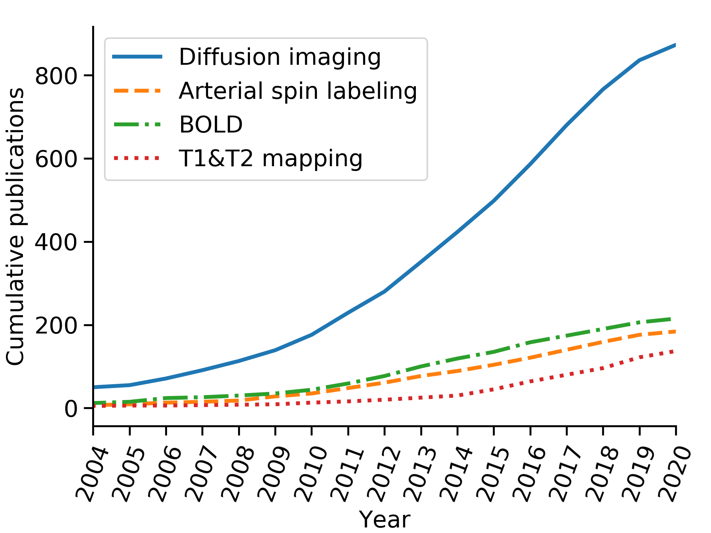

#######################
cumulative_publications
#######################

Python project containing code used to generate a plot of the cumulative number publications in the field of renal MRI, which was `published in [1] <https://link.springer.com/article/10.1007/s10334-019-00784-w>`_.

An updated plot (as of Jan 2020 is below):

Instructions to run this code
*****************************

Installation
============
Install the all necessary dependencies using the ``requirements.txt`` file.
For example, to create a virtual environment with conda named ``cumulative_publications`` do::

    conda create --name cumulative_publications --file requirements.txt

Specify user email
==================

Specify user email by modifying the variable ``EMAIL`` in the ``cumulative_publications.py`` module.
If your email is johndoe@email.com, open ``cumulative_publications.py`` and modify the line::

    EMAIL = 'user@email.com'

to::

    EMAIL = 'johndoe@email.com'

This is a requirement from NCBI: "*The value of email should be a complete and valid e-mail address of the software developer and not that of a third-party end user. The value of email will be used only to contact developers if NCBI observes requests that violate our policies, and we will attempt such contact prior to blocking access.*" (`source <https://www.ncbi.nlm.nih.gov/books/NBK25497/>`_).

References
**********

[1]	I. Mendichovszky et al., “Technical recommendations for clinical translation of renal MRI: a consensus project of the Cooperation in Science and Technology Action PARENCHIMA,” Magn. Reson. Mater. Physics, Biol. Med., Oct. 2019. https://doi.org/10.1007/s10334-019-00784-w